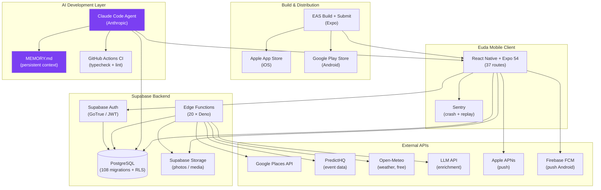

# Standards & Ecosystem Compatibility

**Supports report section: G (standards and ecosystem)**

---

## 1. Euda's Ecosystem Dependencies

### Mobile OS Platform Layer

| Standard / Platform | Requirement | Euda Implementation | Risk Level |
|---------------------|-------------|---------------------|------------|
| Apple App Store | Developer Program ($99/yr); Review Guidelines; Privacy Nutrition Labels; ATS (App Transport Security) | `app.json` bundle ID `com.euda.app`; EAS submit profile; `docs/APP_STORE_CHECKLIST.md` | Medium — Apple review is a gatekeeping risk |
| Apple Universal Links | `apple-app-site-association` JSON file on verified domain; entitlement in app | `links.euda.live` domain; `docs/IOS_UNIVERSAL_LINKS_TEST.md` | Low — documented and tested |
| Apple APNs (push) | APNs certificate/key; Expo push token service | `src/lib/notifications.ts`; migration 084; `eas.json` APNs config | Low — standard implementation |
| Google Play Store | Google Play Console; Billing Policy; Privacy Policy link; Android Asset Links | `app.json` Android package `com.euda.app`; `docs/ANDROID_SHA256.md` | Medium — Play policy compliance needed |
| FCM (Firebase Cloud Messaging) | Google Services JSON; FCM server key | `src/lib/notifications.ts` | Low — handled by expo-notifications |
| iOS Privacy Manifest | Required by Apple since iOS 17.4 for certain APIs (location, camera, contacts) | `app.json` includes usage description strings | Low — standard practice |

### Authentication and Identity

| Standard | Implementation | Evidence |
|----------|---------------|----------|
| OAuth 2.0 / JWT | Supabase Auth (GoTrue) handles token issuance, refresh, and revocation | `src/lib/supabase.ts`; `src/contexts/AuthContext.tsx` |
| PKCE (OAuth 2.0) | Implied by Supabase Auth for web flows | Supabase GoTrue default |
| Secure token storage | `expo-secure-store` — uses iOS Keychain / Android Keystore | `src/utils/storage.ts` |
| Magic link / OTP auth | Supabase email magic link | Auth flow in `app/(auth)/` |

### External Data APIs

| API | Provider | Dependency Type | ToS Risk | Fallback |
|-----|----------|----------------|---------|---------|
| Google Places API | Google (billed) | Core data source for activities | Medium — usage quotas; ToS restricts caching | PredictHQ, web collector |
| PredictHQ Events API | PredictHQ (subscription) | Event data ingestion | Low — B2B API, standard ToS | Google Places, web collector |
| Open-Meteo | Open-Meteo (free, open) | Weather signal in recommender | Very Low — free, no ToS restrictions | Disable weather signal via feature flag |
| Mapbox / Google Maps (via react-native-maps) | Google / Mapbox | Map tile rendering | Medium — Google Maps API billing | Could switch to OSM/Mapbox |
| Sentry | Sentry (proprietary SaaS) | Crash reporting + session replay | Low — standard SaaS | Could self-host Sentry open source |

### Content Standards

| Standard | Applicability | Euda Status |
|----------|--------------|-------------|
| GDPR (EU) | If Euda serves EU users | `docs/PRIVACY_POLICY.md`, `docs/DATA_PRACTICES.md` present; GDPR data practices documented |
| CCPA (California) | US users in California | Addressed in privacy policy |
| COPPA (US children's privacy) | App targets 18+; must prevent under-13 users | Age gate not implemented in code — gap to address |
| CAN-SPAM / SMS regulations | Push notifications | Unsubscribe mechanism exists (notification preferences; `remove_push_token` on sign-out) |

---

## 2. Agentic Coding Platform Ecosystem

### Claude Code / Anthropic

| Dimension | Detail |
|-----------|--------|
| Core interface | REST API (messages API); CLI (Claude Code) |
| IDE integration | VSCode extension; JetBrains (planned) |
| Tool extension | MCP (Model Context Protocol) — allows third-party tool integrations |
| CI/CD | Git hooks; GitHub Actions compatible; no native CI plugin |
| Enterprise security | SSO, audit logs, data residency (enterprise tier) |
| Open standards | MCP is open-sourced; API follows HTTP/REST standards |
| Lock-in risk | Medium — API abstraction layer possible; switching to OpenAI API requires prompt adjustments |

### Git / Version Control Standards
Claude Code integrates natively with git:
- Reads file history for context
- Generates commit messages following conventional commits standard
- Respects `.gitignore` for secrets management
- Branch-aware context (HEAD, modified files)

### Developer Tooling Compatibility
| Tool | Compatibility | Evidence |
|------|-------------|---------|
| VSCode | Native extension | Primary IDE for Euda development |
| GitHub Actions | Full — runs any bash commands | `.github/workflows/ci.yml` |
| npm / Node.js | Full — package.json native | Standard project structure |
| TypeScript | Full — reads and generates TS | All 70 source files |
| ESLint / Prettier | Full — respects config files | `.eslintrc`, `.prettierrc` |
| Jest | Full — generates test files | `src/lib/__tests__/` |

---

## 3. Ecosystem Map (Mermaid Diagram)

---

## 4. Openness vs. Control Analysis

### For Euda (startup perspective)

| Platform | Open/Closed | Lock-in Level | Strategic Assessment |
|----------|-------------|--------------|---------------------|
| Supabase | Open-source core; managed cloud | Low-Medium | Can self-host if needed; low exit cost |
| Expo / React Native | Open-source | Low | Large community; can eject to bare workflow |
| Apple App Store | Closed | High (irreducible) | No alternative for iOS; regulatory pressure (EU DMA) gradually opening |
| Google Play | Closed | Medium-High | Some Android sideloading possible; Play preferred for reach |
| Claude Code API | Closed | Medium | Could switch to OpenAI/Gemini API with prompt adjustments; no infrastructure lock-in |
| Google Places API | Closed (proprietary, billed) | Medium | OSM/Mapbox as alternative; would require re-indexing existing data |
| Sentry | Closed (SaaS) | Low | Can self-host open-source Sentry; or switch to Datadog/Rollbar |

**Strategic recommendation for Euda:** The current stack is well-balanced. The highest lock-in risks (Apple App Store) are irreducible for iOS reach. The agentic coding dependency (Claude Code / Anthropic API) carries moderate lock-in — mitigated by the fact that the codebase itself (TypeScript + Supabase) is portable and not tied to the agent.

### For Enterprises Adopting Agentic Coding

| Concern | Open alternative | Closed leader |
|---------|-----------------|---------------|
| Code generation | Continue.dev + Ollama (local LLM) | GitHub Copilot; Cursor; Claude Code |
| Model runtime | Self-hosted Llama / Mistral | Anthropic API; OpenAI API |
| IDE integration | Open-source plugins | Cursor IDE; VS Code Copilot |
| Audit trail | Git history (open) | Cursor AI Activity Log; GitHub Copilot audit |

**Enterprise strategic advice:** Avoid architecture where the AI agent writes code that only the same AI agent can understand or extend. The Euda approach — where the agent generates standard TypeScript/SQL that any engineer can read — maintains portability even if the agent is unavailable.
