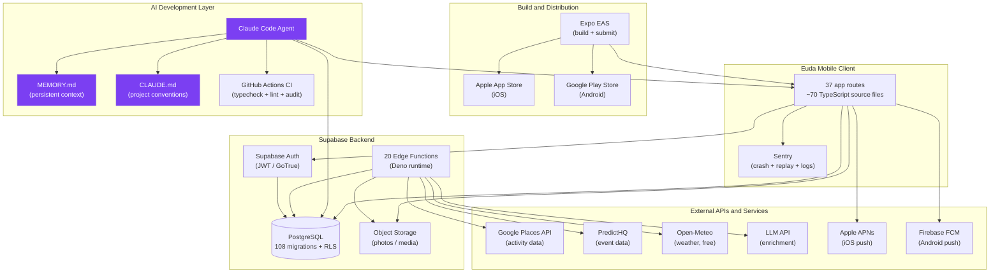

# Required Exhibits Bundle

**Supports all report sections requiring visuals/exhibits**

Each exhibit includes: Title, Purpose, How it will be used in the report, Data source, and the exhibit itself.

---

## Exhibit 1: Value Proposition Comparison Table

**Title:** "Software Development Approach Comparison: Status Quo vs. AI-Assisted vs. Agentic"

**Purpose:** Demonstrate the step-change improvement in productivity, cost, and quality structure that agentic coding represents relative to prior approaches. Shows that agentic coding is not merely an incremental improvement on AI-assisted (Copilot) but a qualitative shift in what a single developer can produce.

**Used in report:** Section A (innovation novelty — demonstrates the step-change), Section B (value creation mechanism), Section H (competitive timing — why building now with agentic tools is a strategic advantage).

**Data source:** Euda case (primary); industry benchmarks (McKinsey "State of AI in 2024"; GitHub Copilot productivity research; DORA metrics). Euda-side figures derived from git history and commit timestamps.

| Attribute | Traditional Team | AI-Assisted (Copilot / autocomplete) | **Agentic (Claude Code)** |
|-----------|-----------------|--------------------------------------|--------------------------|
| Team size for full-stack MVP | 3–5 engineers | 2–3 engineers | **1 engineer** |
| Calendar time to working MVP | 4–9 months | 2–4 months | **4–6 weeks** (Euda: 38 days) |
| Labor cost to MVP | $300K–$900K | $150K–$400K | **$5K–$30K equiv.** + API compute |
| Code review requirement | Peer review mandatory | Peer review recommended | Single human reviewer |
| Documentation quality | Variable; often low priority | Variable | **High** — agent generates docs |
| Test coverage | 60–80% target (varies) | Similar to traditional | **Low** without explicit prompting (~20–30% in Euda) |
| Security review cadence | Periodic (quarterly/annual) | Periodic | **Agent-executed per session** |
| Iteration cycle (1 feature) | 1–2 weeks | 3–5 days | **1–4 hours** |
| Knowledge bus factor | Low (distributed across team) | Low | **High** (solo + agent = single point) |
| Primary cost driver | Engineer salaries | Engineer salaries | **API compute** + 1 engineer |
| Weakest point | Coordination cost; communication overhead | Still requires human for architecture | **Test coverage; review bottleneck** |

*Note: "Traditional" and "AI-assisted" benchmarks from industry literature. Agentic figures from Euda case evidence (38-day build, solo founder, Claude Code primary tool).*

---

## Exhibit 2: S-Curve Placement

**Title:** "Agentic Coding on the Technology S-Curve (2021–2028, Estimated)"

**Purpose:** Situate the current state of agentic coding in its technology lifecycle; justify that we are in the steep growth phase and that early adopters (like Euda's founder) are gaining a compounding advantage relative to laggards.

**Used in report:** Section F (technology trajectory — this is the primary exhibit for this section).

**Data source:** GitHub Copilot adoption data; Stack Overflow Developer Survey 2024 (62% of developers use or plan to use AI coding tools); Bloomberg reporting on Cursor ARR; HumanEval and SWE-Bench benchmark progression; Euda case.

### S-Curve Data Points for Redrawing

| Year | Estimated % Adoption | Key Event | Phase |
|------|---------------------|-----------|-------|
| 2021 | 1% | GitHub Copilot technical preview | Emergence |
| 2022 | 5% | Copilot GA; ChatGPT | Early growth |
| 2023 | 15–20% | GPT-4; early agentic experiments | Growth inflection |
| 2024 | 40–50% | Cursor; Claude 3.5; Devin; Copilot Workspace | **Steep growth** |
| 2025 | 60–65% | Claude Code; Devin 2.0; OpenAI Codex agent | **Steep growth** |
| **2026** | **~70%** | **Euda case — solo dev, 38 days, full-stack** | **Steep growth — current** |
| 2027 (est.) | 82% | Standard practice in startups; enterprise early majority | Decelerating growth |
| 2028 (est.) | 90% | Plateau; laggards adopt | Plateau |

**Figure instructions:** Draw a logistic sigmoid curve. X-axis: 2021–2028. Y-axis: 0–100% adoption. Mark a vertical dashed line at 2026 labeled "Euda case — current position." Mark the inflection point at 2023–2024. Annotate with key events at each data point.

---

## Exhibit 3: Ecosystem Map

**Title:** "Euda + Agentic Coding Full Ecosystem Map"

**Purpose:** Show the complete web of platforms, standards, and external dependencies that Euda relies on, and illustrate where the agentic coding layer fits within the broader development + deployment ecosystem.

**Used in report:** Section G (standards and ecosystem — primary exhibit for this section).

**Data source:** `package.json`, `app.json`, `eas.json`, `supabase/functions/`, `.github/workflows/`, `docs/*.md`.



---

## Exhibit 4: Competitive Positioning Matrix

**Title:** "Event-Discovery App Competitive Positioning Matrix"

**Purpose:** Show Euda's differentiated positioning relative to key competitors. Demonstrates that the target quadrant (friend-network-driven + community/social) is underserved — validating the market opportunity.

**Used in report:** Section H (competitive dynamics — shows entry into an open position).

**Data source:** Public competitor product knowledge; Euda feature set from 01_case_overview.

**Axes:**
- X-axis: Social Depth — Individual/passive (left) → Community/active social graph (right)
- Y-axis: Discovery Mode — Algorithmic/curated (top) → Friend-network-driven (bottom)

```
                          ALGORITHMIC / CURATED
                                   |
              Eventbrite           |      Luma
              Ticketmaster         |    (creator-curated)
                                   |
  INDIVIDUAL ─────────────────────┼──────────────────── COMMUNITY / SOCIAL
                                   |
              Meetup               |    Partiful (parties only)
              Facebook Events      |    ★ EUDA (events + activities)
                                   |
                          FRIEND-NETWORK-DRIVEN
```

| Quadrant | Apps | Euda Assessment |
|----------|------|-----------------|
| Top-left: Algorithmic + Individual | Eventbrite, Ticketmaster | Large incumbent; no social layer |
| Top-right: Algorithmic + Community | Luma | Creator-focused; B2B orientation |
| Bottom-left: Friend + Individual | Snapchat Map | Real-time presence but not event-structured |
| **Bottom-right: Friend + Community** | **★ Euda, Partiful** | **Target quadrant — least crowded** |

**Insight:** Euda's specific differentiation from Partiful is scope — Partiful focuses narrowly on party invites; Euda covers the broader "going out" category including activities, venues, and events with a recommender-driven explore feed.

---

## Exhibit 5: Adoption Funnel / Diffusion Roadmap

**Title:** "Enterprise Agentic Coding Adoption Funnel — From Awareness to Institutional"

**Purpose:** Map the 6 stages of enterprise adoption of agentic coding tools. Identifies the key barrier at each stage and the targeted intervention (diffusion accelerator) that advances organizations to the next stage.

**Used in report:** Section I (adoption and diffusion — primary exhibit for this section).

**Data source:** Rogers diffusion framework; adoption barrier analysis from 10_adoption_diffusion; Euda case as early-majority evidence.

| Stage | # | Entry Metric | Description | Key Barrier | Accelerator |
|-------|---|-------------|-------------|-------------|-------------|
| **Awareness** | 1 | Dev mentions a tool by name | Sees demos, reads case studies, hears at conference | Information overload; skepticism | Case studies; conference talks; peer testimonials (Euda is this) |
| **Trial** | 2 | First productive session completed | Installs Copilot/Cursor/Claude Code; uses for 1 real task | Setup friction (2–4 hours) | "Works out of box" GitHub App; starter templates |
| **Selective Use** | 3 | >10% of coding time via agent | Uses agent for low-risk tasks: docs, tests, boilerplate | Trust in output for "real" feature code | Code review checklist; visible peer wins; lunch-and-learn |
| **Feature Adoption** | 4 | >30% of code agent-generated | Delegates full feature implementation | IP/security concerns; governance gap | IP indemnification; SOC2 attestation; staging environment |
| **Team Adoption** | 5 | >50% of team are active weekly users | Multiple developers sharing conventions | Workflow standardization; training needs | Team CLAUDE.md template; designated "agentic champion" |
| **Institutional** | 6 | Agent integrated into CI/CD; KPIs tracked | Org-level policy and governance | Change management; exec buy-in; culture | Executive sponsorship; quarterly ROI review; formal training |

---

## Exhibit 6: IP / Appropriability Mechanism Table

**Title:** "Euda Appropriability Mechanisms — Protectable vs. Imitable Assets"

**Purpose:** Systematically assess which Euda assets provide durable competitive protection and which are easily copied. Shows that code (IP) is the weakest moat, while social graph and data corpus are the strongest.

**Used in report:** Section E (appropriability — primary exhibit for this section).

**Data source:** Codebase analysis; appropriability analysis from 06_appropriability.

| Asset | Protection Mechanism | Strength | Time to Imitate | Durability |
|-------|---------------------|---------|-----------------|------------|
| Source code (TypeScript + SQL) | Copyright (uncertain for AI-generated) | **Weak** | 4–8 weeks (with same agentic tools) | Low — easily rewritten |
| Euda brand / "Euda" name | Trademark (common-law; formal pending) | **Medium** | 6–18 months to build brand recognition | High — compounds with users |
| Social graph (friend connections) | None (must be grown) | **Very Strong** | Years (organic only) | Very High — network effects |
| Explore item data corpus | Trade secret + lead time | **Medium** | 2–4 months (re-ingestion from same APIs) | Medium-Low — decays as corpus grows |
| Agentic workflow / methodology | Trade secret (tacit know-how) | **Medium** | 1–3 months for experienced developer | Medium — erodes as tools improve |
| Lead time advantage | First-mover position | **High (now)** | Decays over time | Temporary — use it now |
| Network effects (social) | Structural (more users = more value) | **Very High** | Cannot be copied; must be earned | Very High — self-reinforcing |
| App Store presence + reviews | Marketplace lock-in + social proof | **Medium** | 6–12 months to build equivalent reviews | High — App Store rating compounds |

**Summary insight:** Euda's strongest moats are non-IP (network effects, social graph, lead time). Code and brand are the weakest protections. Strategy should prioritize **user acquisition now** (activating network effects) and **brand building** (creating a recognition moat) rather than protecting code IP.
